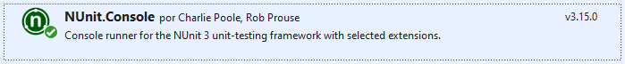

# Automation-Selenium_BoaCosntrictor_Specflow_y_ExtentReports
Un proyecto de automatizacion funcional en C# donde se usa Selenium, Boa.Cosntrictor, Specflow y ExtentReports de manera equivalente a lo que en JAVA sería Selenium, Serenity BDD y Cucumber.
 


## Herramientas utilizadas:
- **IDE:** Microsoft Visual Studio 2019+.
- **Lenguaje:** C#.
- **Frameworks:** .Net Core 3.1, NUnit3, Selenium, Boa Constrictor, Extent reports.
- **Patrón de diseño:** Screenplay + PageObject Model.
- **Gestor de dependencias:** Gestor de paquetes NuGet. 

## .Net Core 3.1
- https://dotnet.microsoft.com/en-us/download/dotnet/3.1


## Paquetes utilizados en el proyecto

\
\
\
\
\
\
\
\
\

# Linea de comandos de ejecución

El siguiente ejemplo ejecutará todos los escenarios que sean de QA y contengan "Web" entre sus tags.

```
dotnet test --filter "Category=QA | Category=Web" --logger trx
```

# Ejemplo de Template de pipeline en Azure para la selección de ambiente y capa de ejecución

```
pool: 'Customer Agent Pool'


parameters: 
- name: environment
  displayName: "Selecciona el ambiente de los test"
  type: string
  values:
#  - certification
  - cert
#  - production
#  - dev
#  - dev2
  - qa
#  - qa2
- name: layer
  displayName: "Selecciona la capa de los test"
  type: string
  values:
  - all
  - App
  - Web
#  - backoffice
#  - restApi
#  - daemons

#trigger: none
trigger:
- devops/task/3143_QA_Tests_Pipeline

variables:
    solutionDir: '$(System.DefaultWorkingDirectory)/DirPrincipal/nombre.proyecto'
    solution: '**/nombre.proyecto/*.sln'
    project: '**/nombre.proyecto/proyecto/*.csproj'
    buildPlatform: 'Any CPU'
#    buildConfiguration: 'Release'
    buildConfiguration: 'Debug'
    ${{ if eq(parameters.layer, 'all') }}:
      layerFilter: '((TestCategory=Web|TestCategory=App)&(TestCategory!=WIP))'
    ${{ else }}:
      layerFilter: '((TestCategory=${{parameters.layer}})&(TestCategory!=WIP))'
    TestRunParameters:  '-- TestRunParameters.Parameter(name=%5C%5C%22Ambiente%5C%5C%22,value=%5C%5C%22${{parameters.environment}}%5C%5C%22)'
    TestRunParameters2: '-- TestRunParameters.Parameter(name=\\\"Ambiente\\\",value=\\\"${{parameters.environment}}\\\")'
steps:
- task: UseDotNet@2
  inputs:
    packageType: 'sdk'
    version: '3.x'
    vsVersion: '2019'

- task: NuGetToolInstaller@1
  inputs:
    versionSpec: '5.8.0'

- task: NuGetCommand@2
  inputs:
    restoreSolution: '$(solution)'

- task: CmdLine@2
  inputs:
    script: 'dotnet --info'

#>> Execution arguments running locally.
#--filter:"(TestCategory=App)" -- 'TestRunParameters.Parameter(name=\"Ambiente\",value=\"cert\")'

#>> It Works but the test result aren't published.
- task: CmdLine@2
  inputs:
    script: 'dotnet test $(solutionDir)\nombreProyecto.sln --logger trx --filter:"$(layerFilter)" $(TestRunParameters2) '

#>> Task to publish the results of the execution instead of viewing them from the previous task.

- task: PublishTestResults@2
  condition: succeededOrFailed()
  inputs:
    testRunner: VSTest
    testResultsFiles: '**/*.trx'
```

# Demo del proyecto

https://user-images.githubusercontent.com/71787981/175858131-f083e523-5674-47aa-833d-c1d839427b59.mp4


|   |   |
| :------------ | :------------ |
|   | **Automatizado por Fernando Barrionuevo.**  |
